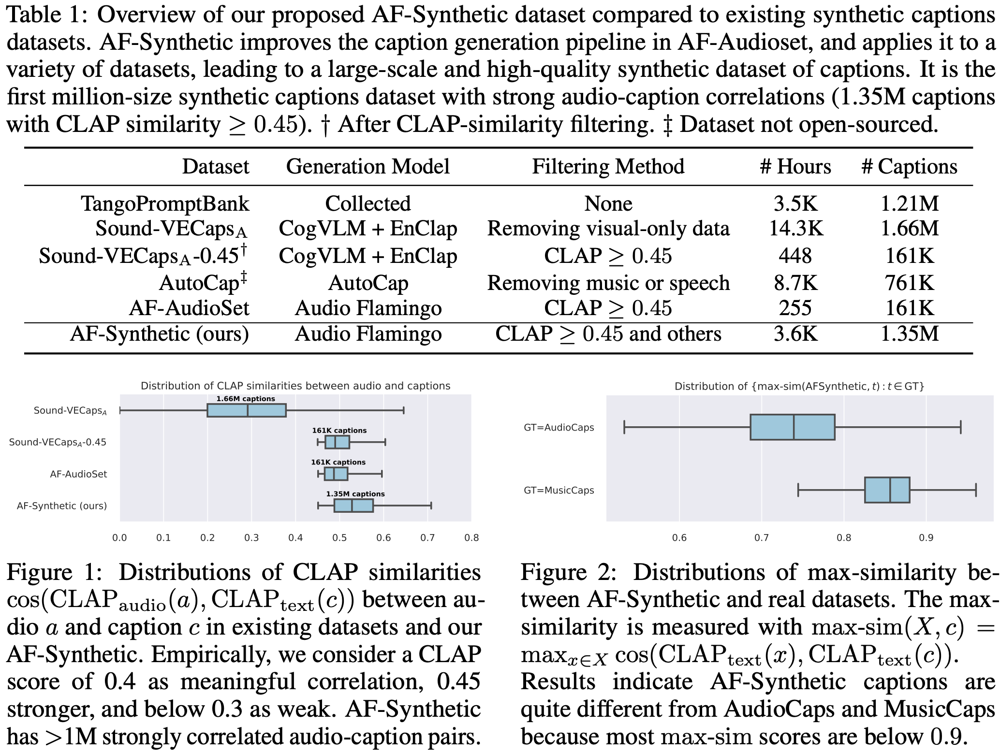

# Steps to create AFSynthetic Dataset

## Overview

The AFSynthetic dataset contains 1.35M high quality captions generated with Audio Flamingo. 



## Step 1: download audio datasets from the original sources. 

- The audio sources include AudioCaps, AudioSet, WavCaps, Laion-630K, and VGGSound. 
- It is ideal to transform all samples into ```.wav``` for faster seek.
- Note: it is possible that some sources have been removed and some audio files are under restricted licenses. Make sure you follow the dataset and audio licenses.

## Step 2: generate raw captions

### AF-AudioSet
- Our previous experimental dataset ```AF-AudioSet``` introduced in [Tango-AF](https://arxiv.org/pdf/2406.15487) is released [here](https://github.com/NVIDIA/audio-flamingo/tree/legacy_audio_flamingo_1/labeling_machine).

### ETTA (ICML 2025) version 
- Our ICML 2025 version of AFSynthetic in ETTA uses [Audio Flamingo](https://arxiv.org/pdf/2402.01831) (ICML 2024) for caption generation. See example inference script in [this python script](https://github.com/NVIDIA/audio-flamingo/blob/legacy_audio_flamingo_1/inference/inference_examples.py).
- Use the ```chat model``` in the [inference script](https://github.com/NVIDIA/audio-flamingo/blob/legacy_audio_flamingo_1/inference/inference_examples.py#L187) (L187), 
- Prepare data chunks in 10s segments -- replace L199-L218 in the inference script with the following:
```
# manifest is the list of samples
# data_root is the root folder to store dataset
audio_duration = 10.0
items = []
for v in manifest:
    name = os.path.join(data_root, v["name"])
    total_duration = librosa.get_duration(name)
    for audio_start_idx in range(int(total_duration // audio_duration)):
        items.append(
            {
                'name': name, 
                'prefix': 'The task is dialog.', 
                'audio_start': audio_start_idx * audio_duration,
                'audio_duration': audio_duration,
                'dialogue': [{"user": "Can you briefly describe what you hear in this audio?"}]
            },
        )
```
- Change ```inference_kwargs``` to 
```
inference_kwargs = {
    "do_sample": True,
    "top_k": 50,
    "top_p": 0.95,
    "num_return_sequences": 20
}
```
- Use command ```outputs = main(config_file, data_root, checkpoint_path, items, inference_kwargs, is_dialogue=True, do_dialogue_last=True)```

### Latest version
- You are encouraged to use [Audio Flamingo 2](https://arxiv.org/pdf/2503.03983) (ICML 2025) for better captioning. 
- Chunk into 10s or 30s segments based on your needs.
- The inference script example is [here](https://github.com/NVIDIA/audio-flamingo/tree/main/inference_HF_pretrained).

## Step 3: CLAP filtering

### ETTA (ICML 2025) version
- Our ICML 2025 version of AFSynthetic in ETTA uses [Laion-CLAP](https://github.com/LAION-AI/CLAP) ```630k-audioset-fusion-best.pt``` for clap similarity computation. 
- The similarity is computed as cosine similarity between audio and text embeddings:
```
@torch.no_grad()
def compute_laionclap_text_audio_sim(audio_file, laionclap_model, outputs, duration=None, start=None):
    data = load_audio(audio_file, target_sr=48000, duration=duration, start=start)
    # compute audio embedding
    audio_data = data.reshape(1, -1)
    audio_data_tensor = torch.from_numpy(int16_to_float32(float32_to_int16(audio_data))).float().cuda()
    audio_embed = laionclap_model.get_audio_embedding_from_data(x=audio_data_tensor, use_tensor=True)
    text_embed = laionclap_model.get_text_embedding(outputs, use_tensor=True)
    cos = torch.nn.CosineSimilarity(dim=1, eps=1e-6)
    cos_similarity = cos(audio_embed.repeat(text_embed.shape[0], 1), text_embed)
    return cos_similarity.squeeze().cpu().numpy()
```
- Choose the captions with ```topk=3``` highest clap scores, and then further filter samples with clap score less than ```0.45```. 


### Latest version
- You are encouraged to use Audio Flamingo 2's AF-Clap model for clap similarity computation [example script](https://github.com/NVIDIA/audio-flamingo/blob/main/AFClap/afclap_similarity.py).
- Choose a clap threshold between ```0.3 - 0.4``` depending on your quality requirements. 

## Step 4: extra filtering 
- Keyword filtering using the following condition
```
def is_low_quality(caption):
    keywords = [
        "noise", "noisy", "unclear", "muffled", "indistinct", "inaudible", "distorted",
        "garbled", "unintelligible", "static", "interference", "echo", "background noise",
        "low volume", "choppy", "feedback", "crackling", "hissing", "fuzzy", "murmur",
        "buzzing", "scrambled", "faint", "broken up", "skipped", "irrelevant",
        "overlapping speech", "reverberation", "clipping", "sibilance", "popping",
        "unspecific", "gibberish", "unknown sounds", "vague", "ambiguous", "incoherent",
        "misheard", "uncertain", "distant", "irregular", "glitch", "skipping", "dropout",
        "artifact", "undermodulated", "overmodulated", "off-mic", "misinterpretation", "unreliable", "fluctuating",
        "low-quality", "low quality", "compromised", "substandard", "inferior", "deficient", "poor",
        "suboptimal", "flawed", "unsatisfactory", "inadequate", "faulty",
        "second-rate", "mediocre", "insufficient", "lacking", "imprecise"
    ]
    # if you do not want to include speech data, add the following keywords
    # keywords += ["speech", "voice", "man", "woman", "male", "female", "baby", "crying", "cries", "speaking", "speak", "speaks", "talk"]
    
    caption_lower = caption.lower()
    for keyword in keywords:
        if keyword.lower() in caption_lower:
            return True
    return False
```
- Sub-sample non-musical samples with ```audio_start > 600```.
- (Optional) Audio quality filtering using [AudioBox Aesthetics scores](https://github.com/facebookresearch/audiobox-aesthetics). We recommend removing samples with ```CE <= 3.38 and PC <= 2.89``` based on our own manual inspections on a number of samples. 
- (Optional) Use an LLM to rephrase captions or shorten long captions. An example prompt is
```
Condense the following description of audio or music into a short caption around 10 to 20 words. Make sure all acoustic information is accurate. For example, a caption like 'People speak and a dog pants' or 'Rapid plastic clicking as a machine blows air loudly followed by a click then blowing air softly' is good.\n
<AUDIO_CAPTION>
```
